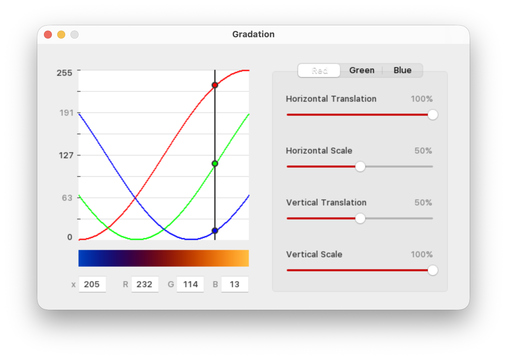

# SineSlider

Experimental project to create more natural looking gradients by interpolating colors with sine waves.

Originally written in Java in May 2017.

Rewritten in Swift (native macOS) in Sept 2026 with the help of AI.

